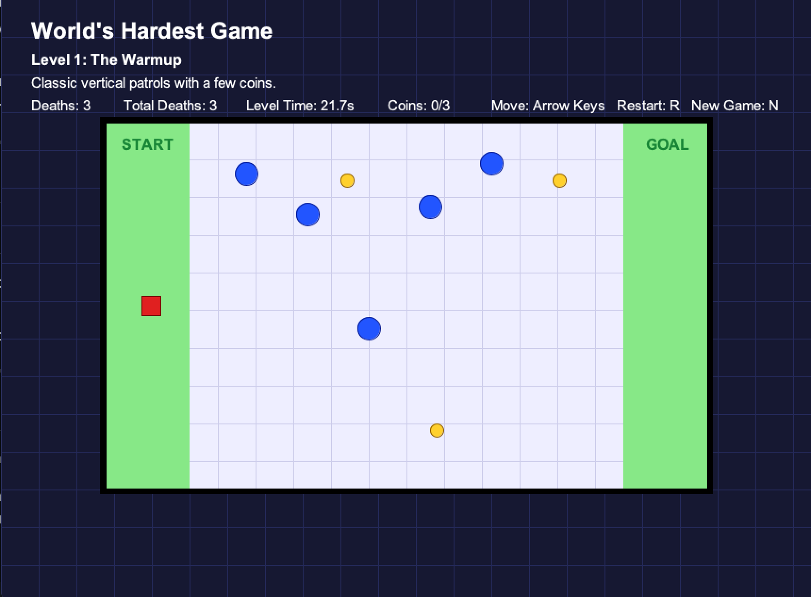

# World's Hardest Game (Java)

A Java desktop game inspired by *The World's Hardest Game*, built with AWT/Swing-style rendering, keyboard input, collision detection, enemy movement, collectibles, levels, and skill-based gameplay.

This project began as an early college programming assignment and was overhauled into a cleaner game development and object-oriented programming showcase.

---

## Features
- Player movement using keyboard input
- Moving enemy obstacles with horizontal and vertical patrol patterns
- Spinning rectangular hazards
- Collision detection between the player and enemies
- Accurate collision detection for spinning hazards using rotated shape intersection
- Respawn behavior after collisions
- Death tracking instead of negative score
- Timer tracking elapsed play time
- Coins/collectibles required before completing each level
- Three playable levels with increasing difficulty
- Start screen, level-complete screen, and campaign-complete screen
- Restart current level with `R`
- Restart full game with `N`
- Cleaner HUD showing level, deaths, total deaths, time, and coins

---

## Tech Stack
- Java
- AWT / Swing-style desktop rendering
- Object-Oriented Programming
- Collision detection
- Game loop logic

---

## Gameplay

Download the runnable JAR from the [latest release](https://github.com/JacobDemory/worlds-hardest-game/releases/latest).



Navigate the red player square from the start zone to the goal zone while avoiding blue enemies and pink spinning hazards. Each level requires collecting all coins before the goal can be completed.

Controls:
```txt
Arrow Keys: Move
Enter: Start / Next Level
R: Restart Current Level
N: Restart Full Game
```

---

## How to Run

1. **Prerequisites**: Ensure Java is installed.
   ```bash
   java -version
   ```

2. **Build and run the project**:
   ```bash
   ./run.sh
   ```

The run script creates a packaged application automatically. You can also build
and launch it separately:

```bash
./build.sh
java -jar dist/worlds-hardest-game.jar
```

## Testing

Run the dependency-free collision and boundary smoke tests:

```bash
./test.sh
```

The GitHub Actions workflow runs these tests, builds the JAR, and uploads it as
a workflow artifact on every push and pull request.

---

## Downloadable Release

Version 1.0.1 is available from [GitHub Releases](https://github.com/JacobDemory/worlds-hardest-game/releases/tag/v1.0.1) and includes:

```text
worlds-hardest-game.jar
```

After downloading the release asset, launch it with:

   ```bash
   java -jar worlds-hardest-game.jar
   ```

---

## Project Structure

```txt
worlds-hardest-game/
├── src/
│   └── game/
│       ├── Enemy.java
│       ├── Game.java
│       ├── IntersectionDetectable.java
│       ├── Player.java
│       ├── SpinningRectangle.java
│       └── WorldsHardestGame.java
├── src/test/java/game/
│   └── CollisionSmokeTest.java
├── .github/workflows/
│   └── build.yml
├── build.sh
├── run.sh
├── test.sh
├── README.md
└── .gitignore
```

---

## Main Classes

### `WorldsHardestGame`
Controls the main game setup, game loop, rendering, levels, HUD, win state, timer, score/death tracking, enemies, collectibles, and keyboard input.

### `Player`
Represents the controllable player square, including movement flags, boundary checks, respawn behavior, and drawing logic.

### `Enemy`
Represents moving circular hazards that patrol horizontally or vertically and use circle-rectangle collision detection against the player.

### `SpinningRectangle`
Represents rotating rectangular hazards and uses shape-based collision detection so the player only dies when touching the visible rotating rectangle.

### `Game`
Handles the Java window/canvas setup and double-buffered drawing.

---

## What I Learned

- How to build a Java desktop game
- How game loops update and repaint the screen
- How to handle keyboard input in Java
- How collision detection works with circles, rectangles, and rotated shapes
- How to structure levels and game state
- How object-oriented design can model players, enemies, hazards, and gameplay systems
- How early projects can be refactored into cleaner, more maintainable code

---

## Future Improvements

- Add more levels with different maze layouts
- Add wall obstacles instead of only open-board hazards
- Add a level-select screen
- Add sound effects and background music
- Add persistent best times/death counts
- Add a short gameplay GIF
- Improve visual polish with custom sprites or smoother animations
